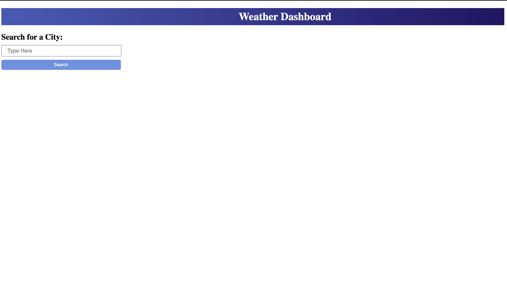
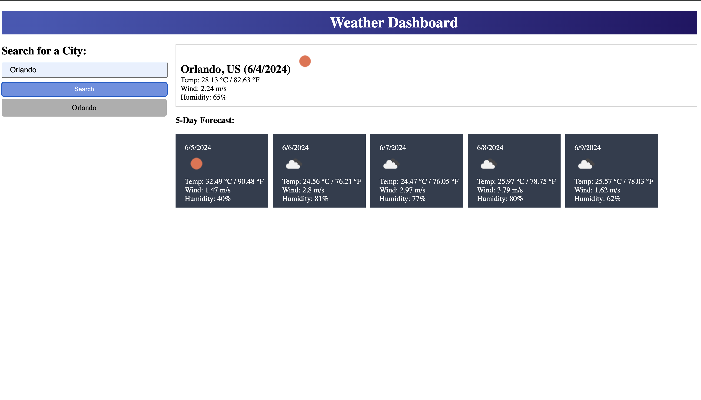
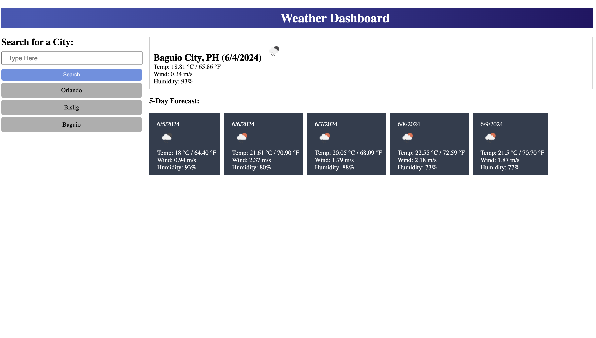
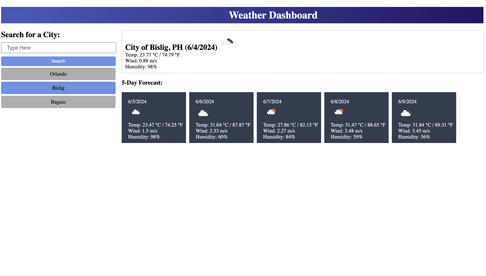

# 🌦️ Weather Wizard

## 📝 Description
The Weather Wizard dashboard is a web application that provides users with current and future weather conditions for multiple cities. Whether you're planning a trip or just want to stay updated on the weather, the dashboard offers dynamic updates to keep you informed.

## 🔧 Usage
Simply open the weather dashboard in your browser and search for a city to view its current and future weather conditions. The dashboard will also store your search history using localStorage.

[&rarr; This is the link to the website](https://janiandaluz.github.io/weather-wizard/)

[&rarr; This is the link to the GitHub repository](https://github.com/janiandaluz/weather-wizard)

## 💡 Key Features
- Dynamic Updates: HTML and CSS are dynamically updated to display current and future weather conditions.
- Multiple Cities: Users can view weather outlooks for multiple cities, aiding in trip planning.
- LocalStorage Storage: Search history is stored using localStorage for easy access to previously searched cities.
- User-friendly Interface: Easily view city names, dates, weather icons, temperatures, humidity, and wind speed.
- 5-Day Forecast: Future weather conditions for each city are displayed for the next five days.

## 🛠️ Technologies Used
- HTML
- CSS
- JavaScript
- OpenWeatherMap API

## 🤝 Contributions
Contributions to the Weather Dashboard project are welcome! Fork the repository, make your changes, and submit a pull request.

## 🎖️ Credits
- Credits given to fellow classmates, TAs, and instructor.
- Credits to the following links:
    - [5 Day Weather Forecast](https://openweathermap.org/forecast5)
    - [stackoverflow](https://stackoverflow.com/)

## 🔒 License
This project is licensed under the MIT License.
